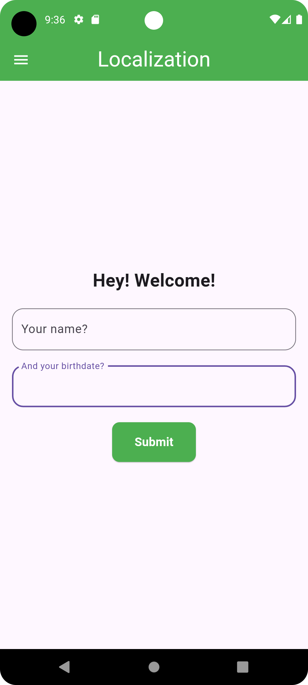
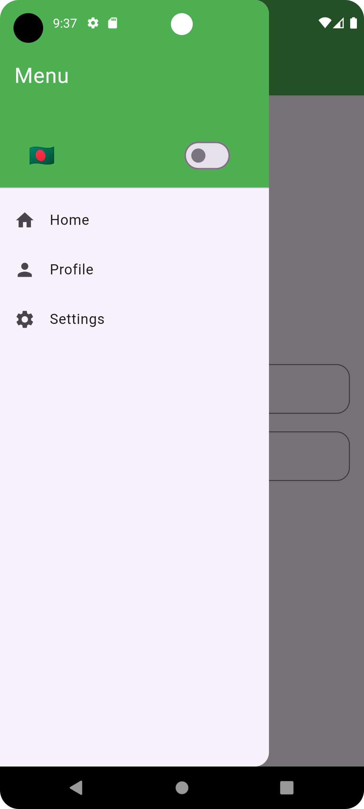
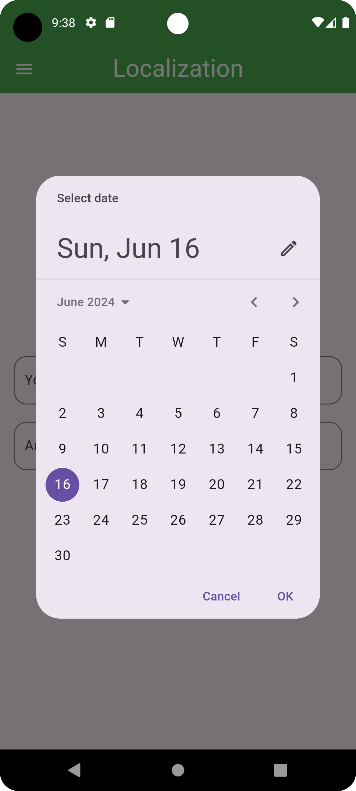
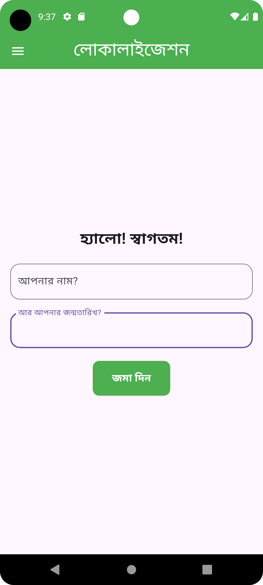
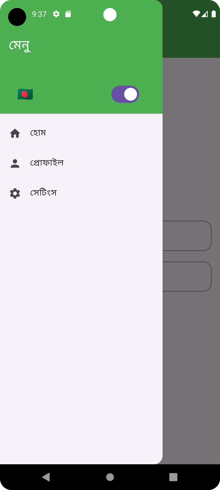
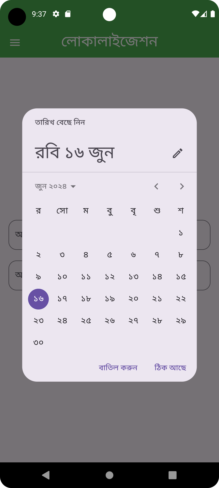

# Flutter Localization

Flutter localization refers to the process of adapting a Flutter application to different languages and regions, enhancing its usability for a global audience. Localization in Flutter involves translating the app's text, adjusting its layout for right-to-left (RTL) languages, and adapting other locale-specific elements such as date and number formats.

Key components of Flutter localization include:

1. Arb (Application Resource Bundle) Files: These are JSON-like files used to store localized strings for different languages.
2. intl Package: A Dart package that provides tools for internationalization and localization, such as date formatting and message translation.
3. Localization Delegates and Locales: These are used to configure the supported languages in the app and manage the loading of localized resources.
4. MaterialApp or CupertinoApp Configuration: Localization settings are typically integrated into the app's root widget, enabling the app to adapt to the device's locale settings automatically.

Implementing localization in Flutter ensures that the app can reach a wider audience by providing an intuitive and culturally relevant user experience for users worldwide.

## Features

- English Language
- Bangla Language
- Save selected language in local db

## Showcase

<table>

  <tr>
    <td></td>
    <td></td>
    <td></td>
  </tr>
  <tr>
    <td></td>
    <td></td>
    <td></td>
  </tr>
 </table>
 

 
 

## Stacks

- Dart
- Flutter
- Localization

<!--
## Q/A

<pre>
1. What does <i>WidgetsFlutterBinding.ensureInitialized()</i> do? 

That means Flutter needs to call native code before calling runApp.
It is used to communicate with platform channel(from Engine layer) to call the native code.
In this project, flutter communicates with native platfort to get <i>getApplicationDocumentsDirectory</i> which is a platform specific storage location.
</pre>

 

## Topics to have a look
- BLoC
- BLoC debugger info
- BlocBuilder
- BlocListener
- BlocConsumer
- HydratedBloc
-->

## Packages and dependencies

- [intl](https://https://pub.dev/packages/intl)
- [flutter_localizations](https://https://pub.dev/packages/flutter_localization)

 
 

<!--
## Issues
- Can't Run Flutter Project Exited (sigterm)

<pre>
flutter clean 
flutter pub get 
</pre>

- Undefined name 'HydratedBlocOverrides'

<pre>
Had to downgrade hydrated_bloc from latest to ^8.1.0 version
</pre>
-->